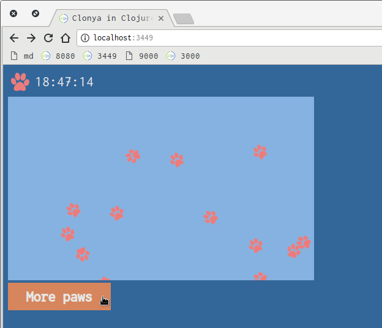

# clonya

This is a minimal ClojureScript application featuring:

- Leiningen
- Figwheel-sidecar
- Vim
- vim-fireplace

# Files

    ├── README.md
    ├── dev
    │   └── user.clj
    ├── project.clj
    ├── resources
    │   └── public
    │       ├── css
    │       │   └── style.css
    │       └── index.html
    └── src
        └── clonya
            └── core.cljs

# Dev

First start Clojure REPL. It's a traditional REPL session with nREPL server and REPL-y(the client).

     $ lein repl

Then start Figwheel server.

    user=> (startfig)

Figwheel takes care of lots of things:

- compliles your CLJS sources once
- serves HTML pages at port 3449
- watches source files to reload when you changed one
- also CSS files will be reloaded automatically (but not HTML files)

So open `http://localhost:3449/` with a browser(Chrome is recommended).

Finally open `core.cljs` with Vim and let vim-fireplace launch CLJS REPL and connect to it. It's a CLJS bREPL(browser REPL) provided by Figwheel.

    :Piggieback (figwheel-sidecar.repl-api/repl-env)

Now you can do `cpp`, `K`, `:Eval (js/alert "hey")`, `]<C-D>`, `]d`, etc...

## Tips

A custom vim command would help you. Add below line to your `.vimrc`.

    command! PigFig execute('Piggieback (figwheel-sidecar.repl-api/repl-env)')

When something's wrong, do `:Piggieback!` to disconnect and `:PigFig` to connect again.

Be carefull no to do anything before connect to CLJS bREPL, otherwise vim-fireplace falls back to Nashorn REPL, which has no DOM, no console.

## Caveat

- `K` doesn't seem to work for some symbols like `def`
- when you defined Vars on the fly, source code lookup(line `]<C-D>` and `]d`) for them won't work until you reconnect(`:Piggieback!` and `:PigFig`)

# Release

Compile all into one JS file(`resources/public/js/compiled/clonya.js`).

    $ lein cljsbuild once min

Try it by a web server(lein-simpleton) to see all good.

    $ lein simpleton 8080 file :from resources/public/

# Annotated project.clj

The project is base on the `figwheel` leiningen template.

    (defproject clonya "0.1.0-SNAPSHOT"
      :description "A ClojureScript project"

      :dependencies [[org.clojure/clojure "1.9.0"]
                     [org.clojure/clojurescript "1.10.238"]]

      ;; No figwheel here becuase we don't do `lein figwheel`.
      ;; We do `lein repl` and start figwheel manually instead.
      :plugins [[lein-cljsbuild "1.1.7" :exclusions [[org.clojure/clojure]]]
                [lein-simpleton "1.3.0"]]

      :source-paths ["src"]

      ;; Remember this is not for CLJ but for CLJS.
      :cljsbuild
      {:builds
       [{:id "dev"
         :source-paths ["src"]
         :compiler {:main clonya.core
                    :optimizations :none
                    :asset-path "js/compiled/out"
                    :output-to "resources/public/js/compiled/clonya.js"
                    :output-dir "resources/public/js/compiled/out"
                    :source-map-timestamp true}

         ;; You need this even if it's empty
         ;; so that a websocket peer is injected into browser.
         :figwheel {}
         }

        {:id "min"
         :source-paths ["src"]
         :compiler {:main clonya.core
                    :optimizations :advanced
                    :output-to "resources/public/js/compiled/clonya.js"
                    :pretty-print false}}]}

      :figwheel
      {:http-server-root "public"
       :server-port 3449
       :css-dirs ["resources/public/css"]}

      :profiles
      {:dev
       {:dependencies [[figwheel-sidecar "0.5.16"]
                       [cider/piggieback "0.3.3"]
                       [org.clojure/tools.nrepl "0.2.13"]]

        ;; Some fn's are defined in the user namespace.
        ;; Those code are under `dev` directory.
        :source-paths ["src" "dev"]

        ;; for vim-fireplace
        :plugins [[cider/cider-nrepl "0.17.0"]]
        :repl-options {:nrepl-middleware
                       [cider.piggieback/wrap-cljs-repl]}

        :clean-targets
        ^{:protect false} [:target-path
                           "resources/public/js/compiled"]}})

